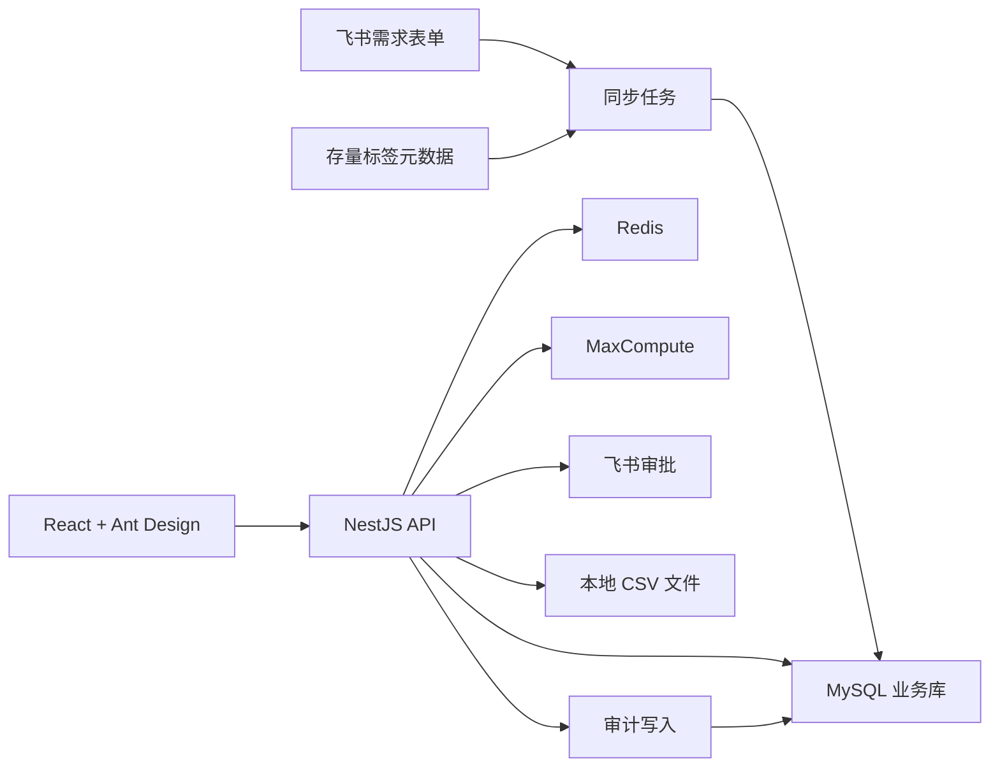

# 用户画像平台一期技术设计

## 1. 设计目标

本设计用于承接 `phase1-prd.md`，把画像平台一期拆成可开发、可评审、可本地验证的技术方案。

一期重点不是建设复杂画像引擎，而是先跑通以下闭环：

```text
存量标签元数据导入 -> 标签目录/详情/地图 -> 人群圈选预估 -> 保存人群包 -> 提交导出 -> 飞书审批 -> 本地 CSV 导出 -> 审计追溯
```

## 2. 总体架构



## 3. 技术选型

| 模块 | 选型 | 说明 |
| --- | --- | --- |
| 前端 | React + Ant Design | 内部后台页面开发效率高 |
| 后端 | NestJS | 适合规则 JSON、审批集成、导出任务和数仓查询编排 |
| 业务库 | MySQL 8.0 | 存平台管理数据，不存全量用户标签明细 |
| 缓存 | Redis | 缓存标签目录、人群预估、导出任务锁 |
| 数仓 | MaxCompute / DataWorks | 用户级标签明细、人群预估和后续导出计算 |
| 审批 | 飞书审批 | 导出审批复用飞书流程 |
| 导出文件 | 服务端本地 CSV | 一期快速验证，记录路径和有效期 |

后端优先采用 NestJS。主要原因是一期大量能力是“平台业务编排”：元数据同步、条件 JSON、飞书审批、任务状态、审计记录和 MaxCompute 查询，不是高并发交易系统。NestJS 能更快把闭环跑通，并保持模块结构清晰。

## 4. 数据存储边界

### 4.1 业务库存什么

MySQL 业务库存平台管理对象：

- 标签元数据镜像。
- 标签值字典。
- 人群包和人群包版本。
- 导出任务和飞书审批实例。
- 权限授权。
- 审计日志。
- 标签需求记录。
- 同步日志。

业务库不存全量用户标签明细，不作为用户画像明细库。

### 4.2 数仓存什么

MaxCompute / DataWorks 保留数据明细和计算结果：

- 画像宽表，例如 `dws_ad_uuid_user_profile_df_1d`。
- 标签质量统计。
- 人群圈选 SQL 计算。
- 后续如需沉淀导出结果表，也应放在数仓侧并设置生命周期。

### 4.3 本地文件存什么

一期导出结果落服务端本地 CSV：

```text
storage/exports/{export_task_id}.csv
```

文件必须设置过期时间，并通过定时清理任务删除。

## 5. 业务库表设计

DDL 草案见：

```text
sql/profile_platform_mysql_ddl.sql
```

核心表：

| 表 | 用途 |
| --- | --- |
| `profile_tag_metadata` | 标签元数据镜像 |
| `profile_tag_value_dict` | 枚举值和值域说明 |
| `profile_audience_package` | 人群包主表 |
| `profile_audience_version` | 人群包版本 |
| `profile_export_task` | 导出任务与审批状态 |
| `profile_permission_grant` | 权限授权 |
| `profile_audit_log` | 审计日志 |
| `profile_tag_requirement` | 标签需求记录 |
| `profile_sync_log` | 同步日志 |

## 6. API 设计

接口统一使用 `/api/v1` 前缀。所有接口都需要识别当前用户身份，并写入必要审计。

### 6.1 标签目录与详情

| 方法 | 路径 | 说明 |
| --- | --- | --- |
| `GET` | `/api/v1/tags` | 标签列表，支持搜索和筛选 |
| `GET` | `/api/v1/tags/{tagCode}` | 标签详情 |
| `GET` | `/api/v1/tags/map` | 标签地图分布 |
| `GET` | `/api/v1/tags/{tagCode}/quality` | 标签质量信息 |
| `GET` | `/api/v1/tag-values/{tagCode}` | 标签值字典 |

标签列表筛选参数：

- `keyword`
- `categoryL1`
- `categoryL2`
- `product`
- `marketRegion`
- `status`
- `valueType`
- `sensitivityLevel`
- `dataOwner`

### 6.2 人群圈选

| 方法 | 路径 | 说明 |
| --- | --- | --- |
| `POST` | `/api/v1/audiences/preview` | 预估人群规模 |
| `POST` | `/api/v1/audiences` | 保存人群包 |
| `GET` | `/api/v1/audiences` | 人群包列表 |
| `GET` | `/api/v1/audiences/{audienceId}` | 人群包详情 |
| `PUT` | `/api/v1/audiences/{audienceId}` | 修改人群包并生成版本 |
| `POST` | `/api/v1/audiences/{audienceId}/expire` | 失效人群包 |

圈选条件 JSON：

```json
{
  "logic": "AND",
  "conditions": [
    {
      "tag_code": "user_is_vip",
      "operator": "eq",
      "value": "是"
    },
    {
      "tag_code": "user_generate_media_cnt",
      "operator": "gte",
      "value": 10
    }
  ]
}
```

一期只支持全局 `AND` / `OR`，不支持复杂嵌套。

### 6.3 导出任务

| 方法 | 路径 | 说明 |
| --- | --- | --- |
| `POST` | `/api/v1/export-tasks` | 提交导出申请 |
| `GET` | `/api/v1/export-tasks` | 导出任务列表 |
| `GET` | `/api/v1/export-tasks/{taskId}` | 导出任务详情 |
| `POST` | `/api/v1/export-tasks/{taskId}/approval/sync` | 同步飞书审批状态 |
| `POST` | `/api/v1/export-tasks/{taskId}/run` | 审批通过后执行导出 |
| `GET` | `/api/v1/export-tasks/{taskId}/download` | 下载导出文件 |

提交导出请求：

```json
{
  "audience_id": "aud_202605140001",
  "business_purpose": "会员召回活动",
  "export_fields": ["uuid", "audience_id", "matched_tag_summary", "created_time"],
  "expire_time": "2026-05-21 23:59:59"
}
```

### 6.4 需求看板

| 方法 | 路径 | 说明 |
| --- | --- | --- |
| `GET` | `/api/v1/requirements` | 需求列表 |
| `GET` | `/api/v1/requirements/{requirementId}` | 需求详情 |
| `POST` | `/api/v1/requirements/sync` | 从飞书表单同步需求 |
| `PUT` | `/api/v1/requirements/{requirementId}/status` | 更新需求状态 |

### 6.5 权限与审计

| 方法 | 路径 | 说明 |
| --- | --- | --- |
| `GET` | `/api/v1/permissions/me` | 当前用户权限 |
| `POST` | `/api/v1/permissions/grants` | 授权 |
| `GET` | `/api/v1/audit-logs` | 审计日志查询 |

## 7. 核心数据流

### 7.1 存量标签元数据导入

```text
读取 CSV / 数仓元数据表
-> 字段校验
-> 敏感等级识别
-> upsert profile_tag_metadata
-> 写 profile_sync_log
```

校验规则：

- `tag_id`、`tag_code`、`tag_name` 不能为空。
- `tag_code` 在平台内唯一。
- `tag_subject_key` 一期必须为 `uuid`。
- 敏感字段必须自动标识 `sensitivity_level`。

### 7.2 人群预估

```text
前端提交条件 JSON
-> 后端校验标签是否存在、是否有权限
-> 生成 MaxCompute SQL
-> 查询 count(distinct uuid)
-> 返回预估人数和风险等级
-> 写审计日志
```

SQL 生成原则：

- 只允许选择元数据中已上线的标签。
- 只允许引用标签元数据登记的 `output_table` 和 `output_field`。
- 自动追加最新分区条件。
- 查询只返回聚合结果，不返回用户明细。
- 调试或明细查询必须有 `LIMIT`。

### 7.3 保存人群包

```text
预估结果确认
-> 保存 profile_audience_package
-> 写 profile_audience_version v1
-> 写审计日志
```

### 7.4 导出审批与执行

```text
提交导出任务
-> 写 profile_export_task pending
-> 发起飞书审批
-> 保存 approval_instance_id / approval_url
-> 同步审批状态
-> 审批通过后异步执行导出
-> 生成本地 CSV
-> 写 output_location / export_user_cnt / completed
-> 写审计日志
```

导出 SQL 只允许导出审批通过的字段。默认字段为：

- `uuid`
- `audience_id`
- `matched_tag_summary`
- `created_time`

### 7.5 飞书需求同步

```text
读取飞书多维表格记录
-> 按字段映射转换
-> upsert profile_tag_requirement
-> 写 profile_sync_log
```

字段映射沿用 PRD 中 `profile_tag_requirement` 映射表。

## 8. 飞书审批接入设计

接入飞书审批时，开发前必须先确认审批模板和 API schema。实际实现时需先读取 `lark-cli approval` 对应 schema，再调用 API，不能猜参数结构。

平台需保存：

- `approval_instance_id`
- `approval_url`
- `approval_status`
- `approved_by`
- `approval_started_time`
- `approval_finished_time`

审批状态映射：

| 飞书状态 | 平台状态 | 后续动作 |
| --- | --- | --- |
| 审批中 | `pending` | 等待 |
| 通过 | `approved` | 允许执行导出 |
| 拒绝 | `rejected` | 不生成文件 |
| 撤回 / 取消 | `cancelled` | 不生成文件 |
| 导出完成 | `completed` | 可下载 |

## 9. 权限与审计实现

### 9.1 权限判断顺序

```text
识别当前用户
-> 判断页面权限
-> 判断标签权限
-> 判断人群包权限
-> 判断导出权限
-> 写审计
-> 返回数据
```

### 9.2 审计要求

以下动作必须写审计：

- 查看敏感标签详情。
- 提交人群预估。
- 保存或修改人群包。
- 提交导出申请。
- 同步审批状态。
- 执行导出。
- 下载导出文件。

审计失败时，不继续展示敏感数据、不生成导出文件。

## 10. 本地验证方案

### 10.1 本地依赖

- Node.js 20+
- Docker
- MySQL 8.0 Docker 容器
- Redis Docker 容器，可选

### 10.2 本地验证步骤

```text
启动 MySQL
-> 执行 sql/profile_platform_mysql_ddl.sql
-> 导入 exports/user_tag_metadata_draft_20260514.csv
-> 启动 NestJS
-> 打开前端
-> 验证标签目录、详情、地图
-> 保存一个人群包
-> 提交导出任务
-> 模拟飞书审批通过
-> 生成本地 CSV
-> 查询审计日志
```

### 10.3 本地验证边界

- 可以用样例用户数据模拟人群预估。
- 飞书审批可先做 mock 状态，再接真实飞书审批。
- 不在本地复制生产用户明细。
- 不在本地导出真实敏感字段。

## 11. 开发拆分建议

### 11.1 第一批：基础底座

- 初始化 NestJS 项目。
- 初始化 React + Ant Design 前端。
- 接入 MySQL。
- 执行业务库 DDL。
- 实现标签元数据导入。

### 11.2 第二批：标签资产

- 标签目录 API。
- 标签详情 API。
- 标签地图 API。
- 标签质量 API。
- 前端标签目录、详情、地图页面。

### 11.3 第三批：人群圈选

- 圈选条件模型。
- 人群预估 API。
- 人群包保存和版本。
- 人群圈选页面。

### 11.4 第四批：导出审批

- 导出任务 API。
- 飞书审批发起与状态同步。
- 本地 CSV 生成。
- 导出任务页面。

### 11.5 第五批：权限审计与验收

- 权限授权表。
- 权限校验中间件。
- 审计日志。
- 端到端验收用例。

## 12. 风险与待确认

| 风险 | 影响 | 建议 |
| --- | --- | --- |
| 飞书审批模板未确定 | 导出审批无法真实发起 | 先 mock，模板确认后接入 |
| 正式 MySQL 资源未就绪 | 无法部署正式环境 | 本地 Docker MySQL 先验证 |
| MaxCompute 查询权限未确认 | 圈选无法查真实数据 | 一期先样例数据，联调前确认权限 |
| 敏感标签权限边界不清 | 有数据泄露风险 | 默认高敏，按申请授权 |
| 导出文件长期保留 | 用户级明细沉淀风险 | 设置过期清理任务 |
